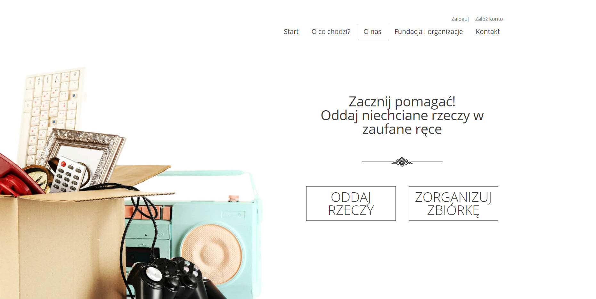
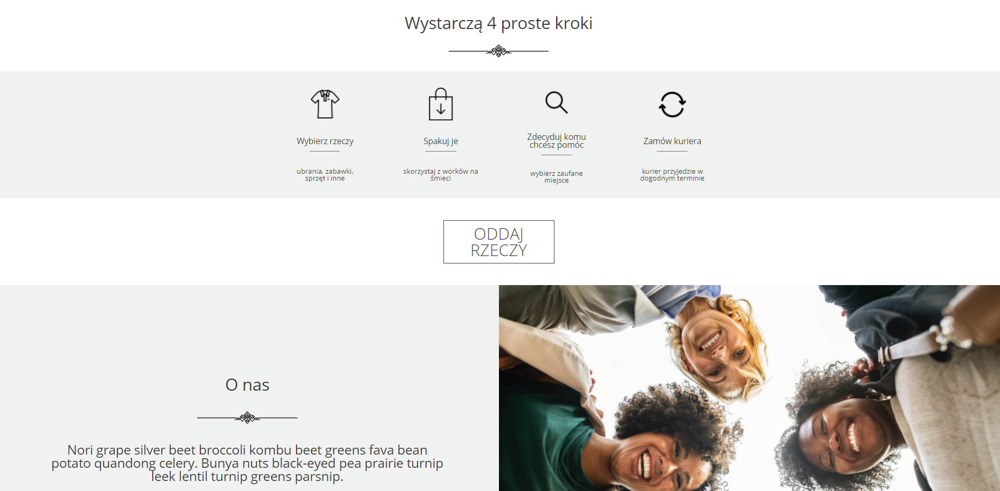
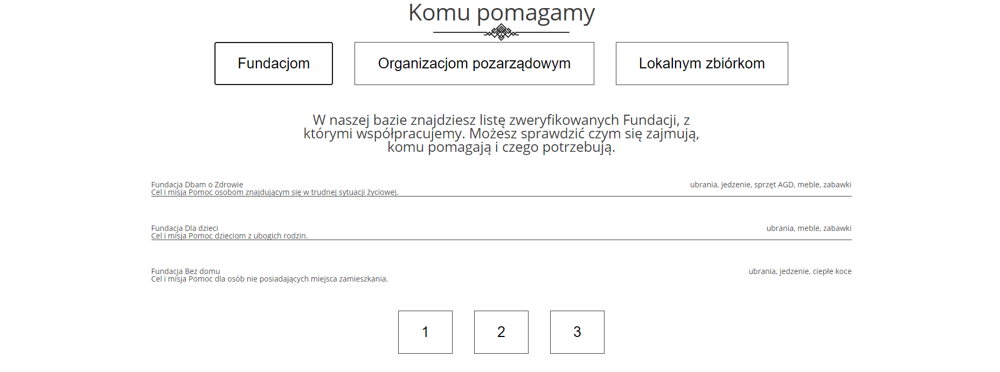
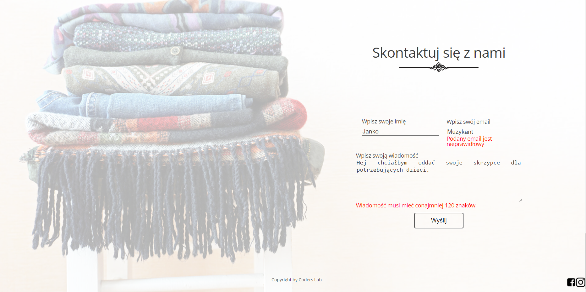

# Oddam w dobre ręce

## Table of contents

* [General info](#general-info)
* [Screenshots](#screenshots)
* [Technologies](#technologies)
* [Setup](#setup)
* [To do list](#to-do-list)
* [Inspiration](#inspiration)

## _General info_

A project created by a graduate of the UX course at the Coders Lab school. The aim of the project is to create a place where everyone can donate unnecessary stuff to trusted institutions.

## _Screenshots_

## _Technologies_

* React     - version 17.0.1
* Node-sass - version 4.14.1
* Node.js

## _Setup_

To run the app, first you need write npm install command to install all dependencies from package.json and then npm start to
run the app in the development mode. It will open at http: // localhost: 3000 in the browser.

## _To-do list:_

* Redux for state management.

* Firebase for user authorization.

* Extended version of the form.

* Extended options for logged in users (regarding items to donate).

* RWD version

## _Inspiration_

 Project inspired by [Coders Lab](https://coderslab.pl/pl/)

### This project was bootstrapped with [Create React App](https://github.com/facebook/create-react-app).
